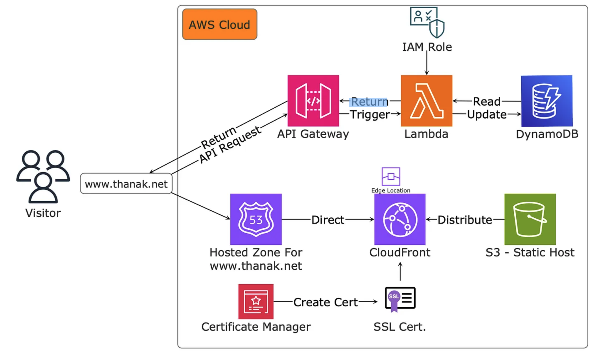

# Cloud Resume Challenge: AWS + DevOps Self Study ☁️ 🚀

This repository is my journey through the Cloud Resume Challenge, where I embarked on an exciting adventure to build a modern, cloud-native resume website. Leveraging the power of AWS, GitHub Actions, and Terraform, I gained invaluable experience in deploying scalable infrastructure and implementing robust DevOps practices. For the original challenge website, please visit: https://cloudresumechallenge.dev

## Overview 🔍

The Cloud Resume Challenge is a hands-on project that challenged me to build a resume website and seamlessly deployed on AWS using various cloud services. The project challenge you to set up a comprehensive CI/CD pipeline for efficient and automated deployments, ensuring a smooth and streamlined development process.

## Features 🌟

- **Resume Website**: A simple website about my professional experience, skills, and projects. The website is dynamically connected to the backend infrastructure, updating the latest visitor count.

- **Cloud Hosting**: Utilizing AWS's robust hosting services, including S3, CloudFront, AWS Certificate Manager, and Route 53, the website is hosted in a highly available and scalable environment.

- **Backend**: Leveraging DynamoDB, Lambda, and API Gateway, I provisioned a reliable database and API endpoint, enabling the website to seamlessly update and retrieve visitor count data.

- **End-to-End Testing**: Playwright, a powerful end-to-end testing framework, was employed to run comprehensive tests on every code commit, ensuring its functionality and reliability throughout the development lifecycle.

- **CI/CD Pipeline**: Embracing modern DevOps practices, I implemented a continuous integration and continuous deployment (CI/CD) pipeline using GitHub Actions and Terraform Cloud, ensuring efficient and automated deployments.

- **Infrastructure as Code**: The entire AWS infrastructure was provisioned using Infrastructure as Code (IaC) with Terraform, managed through Terraform Cloud, promoting consistency and version control.

- **Monitoring and Logging**: To ensure optimal performance and troubleshoot any issues, I integrated CloudWatch and AWS Lambda for comprehensive monitoring and logging capabilities.

## Detailed Process 🔍

- [My Medium Blog](https://medium.com/@nakrattanopastkul/how-to-teach-yourself-aws-4e331f318f10) provides an in-depth account of my journey through this project, detailing the challenges I overcame and the lessons learned along the way.

## Getting Started 🚀

Ready to embark on your own cloud resume adventure? Follow these steps to get started:

1. Clone the repository: `git clone https://github.com/your-username/cloud-resume-challenge.git`
2. Install the required dependencies
3. Configure the necessary AWS credentials and settings
4. Set up Terraform Cloud and connect it to your GitHub repository
5. Deploy the infrastructure using Terraform Cloud and the provided IaC code
6. Build and deploy the website to the provisioned AWS resources using GitHub Actions
7. Run end-to-end tests with Playwright as part of the CI/CD pipeline